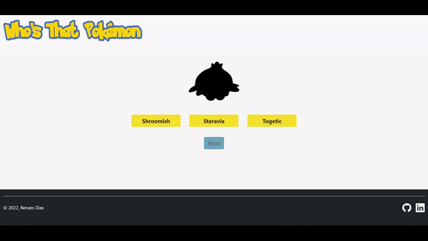

# Who's That Pokémon
Projeto de estudo Next.js. Um simples jogo que consiste em advinhar um determinado Pokémon pela sua silhueta

## Confira a página do projeto [aqui](https://who-is-that-pokemon-rdfn37.vercel.app/home)

### Neste projeto foi utilizado:

- [Next.js (React)]
- [Bootstrap]
- [API externa (pokeapiv2)](https://pokeapi.co/docs/v2)

